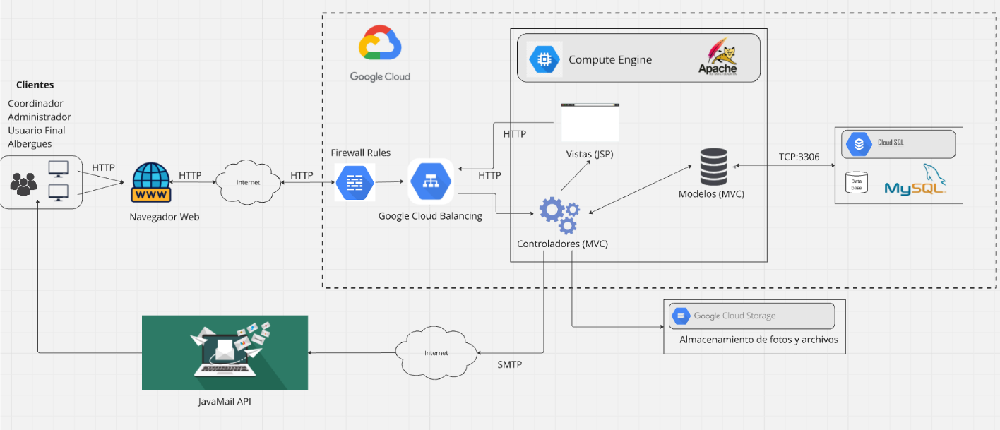

# 🐾 Plataforma de Gestión de Albergues de Animales - Lima Metropolitana

## 📋 Descripción del Proyecto

Este repositorio contiene el código fuente de nuestro proyecto grupal, el cual está enfocado en el desarrollo de una plataforma web para la gestión de albergues de animales en Lima Metropolitana. 

La aplicación permite a los usuarios:
- Interactuar con los albergues
- Realizar donaciones
- Generar y participar en eventos benéficos
- Realizar denuncias sobre maltrato animal
- Postularse como hogares temporales para animales

El sistema incluye un robusto sistema de validación y aprobación por parte de coordinadores zonales, garantizando la calidad y seguridad de todas las interacciones.

## 🛠️ Tecnologías Utilizadas

- **Backend**: Java
- **Frontend**: HTML, CSS, JavaScript
- **Base de Datos**: MySQL
- **Servidor de Aplicaciones**: Apache Tomcat
- **Plataforma de Despliegue**: Google Cloud Platform
- **Servicios GCP**: 
  - Compute Engine
  - Cloud SQL
  - Cloud Storage
  - Load Balancing
- **Comunicación**: JavaMail API para notificaciones por correo

## 👥 Roles del Sistema

El sistema maneja cuatro roles principales con diferentes niveles de acceso y funcionalidades:

### 🏠 Usuario Final
**Descripción**: Actor principal que interactua con los servicios de albergues de animales.

**Funcionalidades**:
- Registrar mascotas perdidas o en adopción
- Participar en eventos benéficos organizados por los albergues
- Postularse como hogar temporal para mascotas
- Realizar donaciones a los albergues (económicas o de artículos)
- Generar denuncias por maltrato animal
- Inscribirse en eventos benéficos y recibir notificaciones

**Credenciales de prueba**:
```
Usuario: usuario.final.test@gmail.com
Contraseña: FinalUser123$
```

### 🏥 Albergue
**Descripción**: Responsable de gestionar las instalaciones y servicios del albergue dentro de la plataforma.

**Funcionalidades**:
- Crear y editar el perfil del albergue
- Gestionar solicitudes de adopción y hogares temporales
- Publicar eventos benéficos para recaudación de fondos
- Recibir y gestionar donaciones
- Gestionar incidencias dentro del albergue
- Crear y actualizar publicaciones sobre mascotas

**Credenciales de prueba**:
```
Usuario: albergue.test@gmail.com
Contraseña: AlbergueSecure2024$
```

### 🗺️ Coordinador Zonal
**Descripción**: Supervisa los albergues dentro de una zona específica de Lima Metropolitana.

**Funcionalidades**:
- Aprobar solicitudes de hogares temporales
- Verificar y aprobar publicaciones de mascotas perdidas
- Gestionar incidencias reportadas
- Administrar albergues en su zona
- Gestionar recursos para casos de emergencia

**Credenciales de prueba**:
```
Usuario: coordinador.zonal.test@gmail.com
Contraseña: ZonalCoord2024$
```

### ⚙️ Administrador
**Descripción**: Acceso total al sistema con responsabilidad de gestión y supervisión general.

**Funcionalidades**:
- Crear y gestionar todos los roles del sistema
- Aprobar o rechazar solicitudes de albergues y coordinadores
- Gestionar sistema de eventos, donaciones y denuncias
- Supervisar base de datos y actividades del sistema
- Acceder al dashboard con estadísticas y análisis completos

**Credenciales de prueba**:
```
Usuario: admin.test@plataforma.com
Contraseña: AdminSecure#2024
```

## 🏗️ Arquitectura del Sistema


*Diagrama completo de la arquitectura del sistema en Google Cloud Platform*

La aplicación sigue un modelo de arquitectura en la nube con los siguientes componentes:

### 1. **Cliente Web**
- Navegadores web que acceden a la aplicación
- Solicitudes HTTP enviadas hacia la infraestructura en la nube

### 2. **Capa de Seguridad**
- **Internet**: Comunicación a través de la red global
- **Firewall Rules**: Filtro de seguridad que permite solo solicitudes válidas

### 3. **Balanceador de Carga**
- **Google Cloud Load Balancing**: Distribuye solicitudes entre múltiples instancias
- Garantiza alta disponibilidad y rendimiento óptimo

### 4. **Servidor de Aplicaciones**
- **Compute Engine**: Instancias de servidor en GCP
- **Apache Tomcat**: Servidor de aplicaciones Java
- **Arquitectura MVC**:
  - **Modelos**: Lógica de negocio y conexión con base de datos
  - **Controladores**: Procesamiento de solicitudes y lógica de aplicación
  - **Vistas (JSP)**: Generación de páginas web dinámicas

### 5. **Base de Datos**
- **Cloud SQL (MySQL)**: Servicio de base de datos gestionado
- Almacena información de usuarios, eventos, mascotas, etc.
- Conexión TCP en puerto 3306

### 6. **Almacenamiento**
- **Google Cloud Storage**: Almacenamiento de archivos y fotografías
- Imágenes de mascotas y documentos del sistema

### 7. **Comunicaciones**
- **JavaMail API**: Envío de correos electrónicos
- **Protocolo SMTP**: Para notificaciones y creación de cuentas


## 📁 Estructura del Proyecto

```
Error404/
├── src/main/java/
│   ├── Beans/           # Entidades del sistema
│   ├── Controllers/     # Servlets de control
│   ├── Daos/           # Acceso a datos
│   ├── DTO/            # Objetos de transferencia
│   ├── Filters/        # Filtros de seguridad
│   └── Services/       # Servicios de negocio
├── src/main/webapp/
│   ├── assets/         # Recursos estáticos
│   ├── css/           # Hojas de estilo
│   ├── js/            # Scripts JavaScript
│   └── WEB-INF/       # Configuración web
├── target/            # Archivos compilados
├── docs/images/        # Imágenes de documentación
└── pom.xml           # Configuración Maven
```

## 🎨 Interfaz de Usuario

### Responsive Design

*La aplicación se adapta a diferentes dispositivos y tamaños de pantalla*

### Flujo de Usuario

*Diagrama del flujo de navegación para diferentes tipos de usuarios*

## 🚀 Despliegue

La aplicación está desplegada en **Google Cloud Platform** utilizando:
- **Compute Engine** para el hosting de la aplicación
- **Cloud SQL** para la base de datos MySQL
- **Cloud Storage** para archivos estáticos
- **Load Balancing** para distribución de carga

## 📊 Base de Datos


*Diagrama Entidad-Relación de la base de datos del sistema*

El sistema utiliza MySQL con las siguientes entidades principales:
- Usuarios y Roles
- Mascotas y Razas
- Albergues y Zonas
- Eventos y Inscripciones
- Donaciones y Solicitudes
- Denuncias y Comentarios

### Esquema de Base de Datos

*Estructura detallada de las tablas y relaciones*

Los archivos SQL se encuentran en la carpeta `DB Files/`:
- `DB_Proyecto.sql`: Estructura de la base de datos
- `Inserts.sql`: Datos de prueba

## 🔧 Instalación y Configuración

### Prerrequisitos
- Java 8 o superior
- Apache Maven
- MySQL 8.0+
- Apache Tomcat 9.0+

### Pasos de Instalación
1. Clonar el repositorio
2. Configurar la base de datos MySQL
3. Ejecutar los scripts SQL en `DB Files/`
4. Configurar las credenciales de base de datos
5. Compilar con Maven: `mvn clean compile`
6. Desplegar en Tomcat

## 📄 Licencia

Proyecto académico - Todos los derechos reservados

---
Desarrollado con ❤️ para mejorar la vida de los animales en Lima Metropolitana
